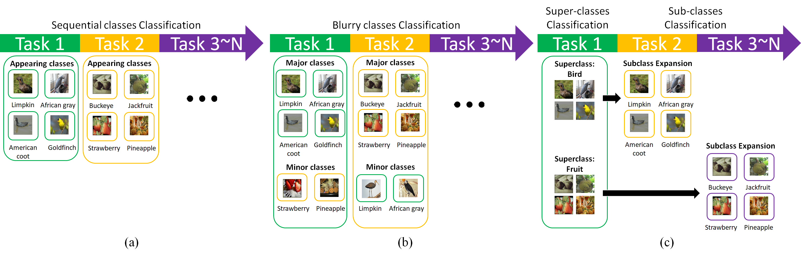
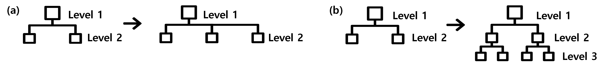
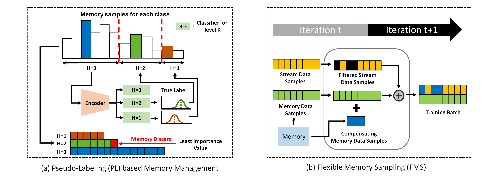

# Official Implementation of PL-FMS (Online Continual Learning on Hierarchical Label Expansion)

**Online Continual Learning on Hierarchical Label Expansion (HLE)**<br>
Byung Hyun Lee<sup>\*</sup>, Okchul Jung<sup>\*</sup>, Jonghyun Choi<sup>&dagger;</sup>, Se Young Chun<sup>&dagger;</sup><br>
(\* indicates equal contribution, &dagger; indicates corresponding author)

ICCV 2023 [[Paper](https://openaccess.thecvf.com/content/ICCV2023/papers/Lee_Online_Continual_Learning_on_Hierarchical_Label_Expansion_ICCV_2023_paper.pdf)]<br>


## Overview
### Comparison to previous setups

(a) conventional task-free online CL, (b) blurry task-free online CL setup, and (c) Proposed HLE CL setup


### Scenarios with hierarchial label expansion

(a) single-depth and (b) multi-depth scenarios

### PL-FMS


### Abstract
Continual learning (CL) enables models to adapt to new tasks and environments without forgetting previously learned knowledge. While current CL setups have ignored the relationship between labels in the past task and the new task with or without small task overlaps, real-world scenarios often involve hierarchical relationships between old and new tasks, posing another challenge for traditional CL approaches. To address this challenge, we propose a novel multi-level hierarchical class incremental task configuration with an online learning constraint, called hierarchical label expansion (HLE). Our configuration allows a network to first learn coarse-grained classes, with data labels continually expanding to more fine-grained classes in various hierarchy depths. To tackle this new setup, we propose a rehearsal-based method that utilizes hierarchy-aware pseudo-labeling to incorporate hierarchical class information. Additionally, we propose a simple yet effective memory management and sampling strategy that selectively adopts samples of newly encountered classes. Our experiments demonstrate that our proposed method can effectively use hierarchy on our HLE setup to improve classification accuracy across all levels of hierarchies, regardless of depth and class imbalance ratio, outperforming prior arts by significant margins while also outperforming them on the conventional disjoint, blurry and i-Blurry CL setups.

### Results


## Getting Started
To set up the environment for running the code, you can either use the docker container, or manually install the requirements in a virtual environment.
### Using Docker Container (Recommended)
We provide the Docker image `khs8157/iblurry` on Docker Hub for reproducing the results.
To download the docker image, run the following command:
<pre>
docker pull khs8157/iblurry:latest
</pre>
After pulling the image, you may run the container via following command:
<pre>
docker run --gpus all -it --shm-size=64gb -v <i>/PATH/TO/CODE</i>:<i>/PATH/TO/CODE</i> --name=<i>CONTAINER_NAME</i> khs8157/iblurry:latest bash
</pre>
Replace the arguments written in <i>italic</i> with your own arguments.

### Requirements
- Python3
- Pytorch (>=1.9)
- torchvision (>=0.10)
- numpy
- pillow~=6.2.1
- torch_optimizer
- randaugment
- easydict
- pandas~=1.1.3

If not using Docker container, install the requirements using the following command
<pre>
pip install -r requirements.txt
</pre>

## Running Experiments

### Downloading the Datasets
CIFAR10, CIFAR100, and TinyImageNet can be downloaded by running the corresponding scripts in the `dataset/` directory.
ImageNet dataset can be downloaded from [Kaggle](https://www.kaggle.com/c/imagenet-object-localization-challenge).

### Experiments Using Shell Script
Experiments for the implemented methods can be run by executing the shell scripts provided in `scripts/` directory.
For example, you may run CL experiments using CLIB method by
<pre>
bash scripts/clib.sh
</pre>
You may change various arguments for different experiments.
- `NOTE`: Short description of the experiment. Experiment result and log will be saved at `results/DATASET/NOTE`.
  - WARNING: logs/results with the same dataset and note will be overwritten!
- `MODE`: CL method to be applied. Methods implemented in this version are: [clib, er, ewc++, bic, mir, gdumb, rm]
- `DATASET`: Dataset to use in experiment. Supported datasets are: [cifar10, cifar100, tinyimagenet, imagenet]
- `N_TASKS`: Number of tasks. Note that corresponding json file should exist in `collections/` directory.
- `N`: Percentage of disjoint classes in i-blurry split. N=100 for full disjoint, N=0 for full blurry. Note that corresponding json file should exist in `collections/` directory.
- `M`: Blurry ratio of blurry classes in i-blurry split. Note that corresponding json file should exist in `collections/` directory.
- `GPU_TRANSFORM`: Perform AutoAug on GPU, for faster running.
- `USE_AMP`: Use automatic mixed precision (amp), for faster running and reducing memory cost.
- `MEM_SIZE`: Maximum number of samples in the episodic memory.
- `ONLINE_ITER`: Number of model updates per sample.
- `EVAL_PERIOD`: Period of evaluation queries, for calculating .

## Citation
If you used our code or i-blurry setup, please cite our paper.
<pre>
@inproceedings{koh2022online,
  title={Online Continual Learning on Class Incremental Blurry Task Configuration with Anytime Inference},
  author={Koh, Hyunseo and Kim, Dahyun and Ha, Jung-Woo and Choi, Jonghyun},
  booktitle={ICLR},
  year={2022}
}
</pre>

## License
```
Copyright (C) 2022-present NAVER Corp.

This program is free software: you can redistribute it and/or modify
it under the terms of the GNU General Public License as published by
the Free Software Foundation, either version 3 of the License, or
(at your option) any later version.

This program is distributed in the hope that it will be useful,
but WITHOUT ANY WARRANTY; without even the implied warranty of
MERCHANTABILITY or FITNESS FOR A PARTICULAR PURPOSE.  See the
GNU General Public License for more details.

You should have received a copy of the GNU General Public License
along with this program.  If not, see <https://www.gnu.org/licenses/>.
```
